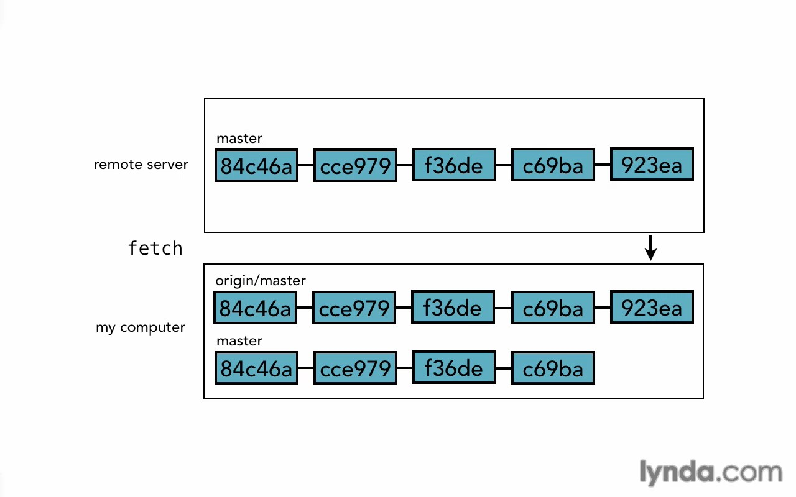
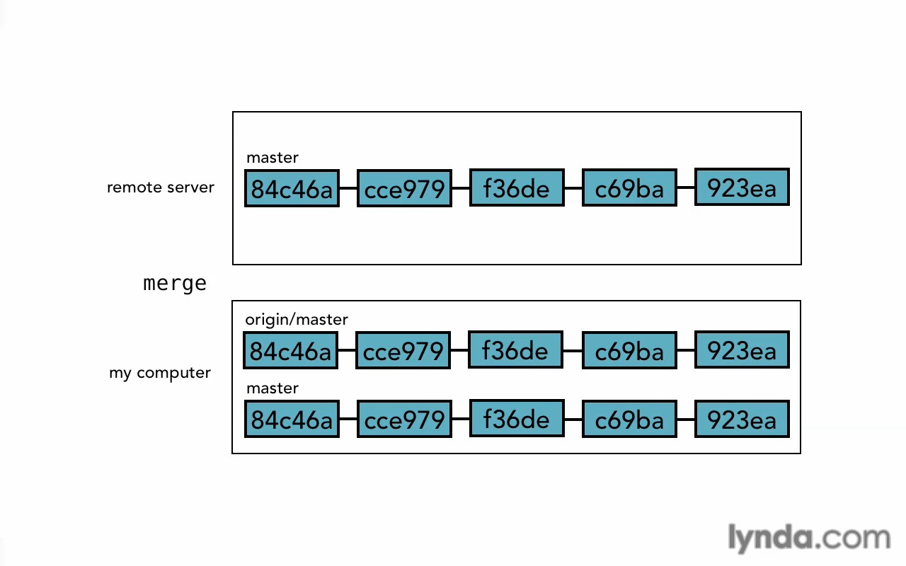

# Remotes

* [Local and remotes](#local-and-remotes)
* [Show remotes](#show-remotes)
* [Adding a remote](#adding-a-remote)
* [Remove a remote](#remove-a-remote)
* [Cloning](#cloning)
* [Work with origin branch](#work-with-origin-branch)
* [Tracking remotes](#tracking-remotes)
* [Fetch from a remote](#fetch-from-a-remote)
* [Merge fetched branch](#merge-fetched-branch)
* [Push your code](#push-your-code)
* [Copy a remote branch](#copy-a-remote-branch)
* [Delete remote branch](#delete-remote-branch)

## Local and remotes
Now you're working on your local and need to share your work with other people or with your team, for that you need a <code>remote</code> repo, Where you and your team can work together.

There are some basic operations when you'll work with remote repo, like <code>push</code> push is an operation to push your code to repo.


In the same time git create a new <code>**HEAD**</code> in our local repo call it for now <code>origin</code>.

> We can change this name <code>origin</code> to whatever we want. <br>
> **Please note we use two branches above for only demonstrate**

The <code>origin</code> is a copy from our HEAD remote repo in our local machines. <br>
When you <code>push</code> the both HEADs will update <code>remote</code> & <code>origin/master</code>.

And if someone push new commits on <code>remote</code> repo and we want to update our <code>origin</code> HEAD with those update we can use <code>fetch</code> operation.



Now we have all the changes on our local repo, and if we need we can <code>merge</code> those changes to our <code>master</code> branch or any other branches to work with them.


We demonstrate above with two branches. <br>
But in reality git only create a new <code>HEAD</code> for <code>remote</code> repo.


> We can short <code>fetch</code> & <code>merge</code> operations with one operation called <code>pull</code>.

We'll see all of those in details next.

**Now we need to create account on a Github to learn our new operations.**

## Show remotes
To show all remotes repos on your local
```bash
git remote
```
And to show more information
```bash
git remote -v
```
> Please note that will appears two URLs for <code>fetch</code> & <code>push</code> and they'll be same, **BUT they can be different.** <br>
You can <code>fetch</code> from a remote repo and <code>push</code> to another.

To show all remote branches
```bash
git branch -r
```
And to show both remote and local branches
```bash
git branch -a
```

## Adding a remote
To add a new remote repo to your local
```bash
git remote add origin https://bla.bla/bla.git
# origin is an alias to your repo, you can name it as you like, but <code>origin</code> is a popular name for master remote repo.
# https... is the URL for that repo.
```

## Remove a remote
To remove a remote you will need its alias
```bash
git remote rm origin
```

## Cloning
Now what if you want to clone the remote project to your empty local.
```bash
git clone https://bla.bla/bla.git folder_name
# folder_name the folder you want to put the project inside it, name it as you like.
# or don't write it and it'll take in this case <code>bla</code> as a folder name.
```
If you want clone from specific branch use <code>-b</code> option.
```bash
git clone -b branch-name https://bla.bla/bla.git folder_name
```

## Work with origin branch
To log origin branch use
```bash
git log origin/branch-name
```
You can use log option here normally.

> When you log, you log the origin branch in your local not the remote repo itself, maybe you need <code>fetch</code> to sync between them.

To show difference between local branch and origin
```bash
git diff origin/branch-name..branch-name
# or the reverse.
git diff branch-name..origin/branch-name
```
And so on use all commands you learned before with origin.

## Tracking remotes
Tracking is a way to tell your local branch what remote branch must follow. <br>
So if you in the next time type <code>push</code> or <code>fetch</code> git will know which branch must deal with, you will not need to write things like <code>origin master</code> just type <code>push</code> for example and git will know what you mean.

To make your branch track the remote branch, you can use <code>-u</code> when you push.
```bash
git push -u origin master
```
Or if you want push and only want tracking for now.
```bash
git branch --track  branch-name origin/branch-name
```
To show if the branch track its origin one, you do that by show your <code>config</code> file.
```bash
cat .git/config
```
You should see something like that
```bash
[branch "branch-name"]
    remote = origin
    merge = refs/heads/branch-name
```

## Fetch from a remote
To fetch new changes in your remote repo to make a sync between them use
```bash
git fetch
```
Or if the branch un-tracking the remote one.
```bash
git fetch origin branch-name
```

## Merge fetched branch
Merge between origin branch and local branch is same like when you merge between other branches.
```bash
git merge origin/branch-name
```
And all things I explain before it's a same here.

Or a fantastic command called <code>pull</code>, it's do the same operations <code>fetch</code> + <code>merge</code>.
```bash
git pull
```
Or if the branch un-tracking the remote one.
```bash
git pull origin branch-name
```

## Push your code
To create your work in a remote branch you need to <code>push</code> it.
```bash
git push -u origin master
# <code>-u</code> for track the branch.
# it's optional you can remove it if you want but it's good practice to track remote branch.
```
Now I tell git to push my work on the remote repo from my master branch.

And if the branch is track the remote one you just need to type
```bash
git push
```
> If you try to push your commits to the remote but there are another commits created, git will give you an error. <br>
<code>push</code> is not merge in remote server, it's only push! <br>
For that you must <code>fetch</code> and <code>merge</code> first in your local and after that <code>push</code>.

In some cases you may want force pushing operation, because git in some case reject this operation like I said.
To do this use <code>-f</code> option.
```bash
git push -f origin branch-name
# or
git push -f origin branch-name:branch-name
```
But let's talk about second command that's contain <code>branch-name:branch-name</code> part. <br>

That's mean push whatever in my local branch called <code>branch-name</code> the first part <code>**branch-name**:branch-name</code> to my remote branch called <code>branch-name</code> also in second part <code>branch-name:**branch-name**</code>.

That's will help us in many cases like the remote branch has a huge differences from your local branch and you need to match your remote branch with your local branch. <br>
Or you returned in some commits and reset some of them, and if you want push git will refuse and tell you to pull first, but that's can duplicate your commits, in this case also you can use <code>-f</code> and <code>branch-name:branch-name</code>

Also you can push from specific commit.
```bash
git push origin 312fasdf:branch-name
```

## Copy a remote branch
You can't mess up with origin branch because git not allow you to do that, for make everything clear. <br>
But you can copy origin branch and work with it like any other normal branch.
```bash
git branch branch-name origin/branch-name
```
And this new branch will track the origin one so you can after that push to it like any normal branch. <br>
And also you can create a new branch and check it out in same step like the command you learn it before.
```bash
git checkout -b branch-name origin/branch-name
```

## Delete remote branch
For delete a branch from your remote.
```bash
git push origin --delete branch-name
# or short one
git push origin :branch-name
```
Now the branch will delete from you remote but it'll still there in your local.

> Note when you put the first part empty that's mean push nothing to remote branch, in short way it'll delete it. <br>
Please check push section.