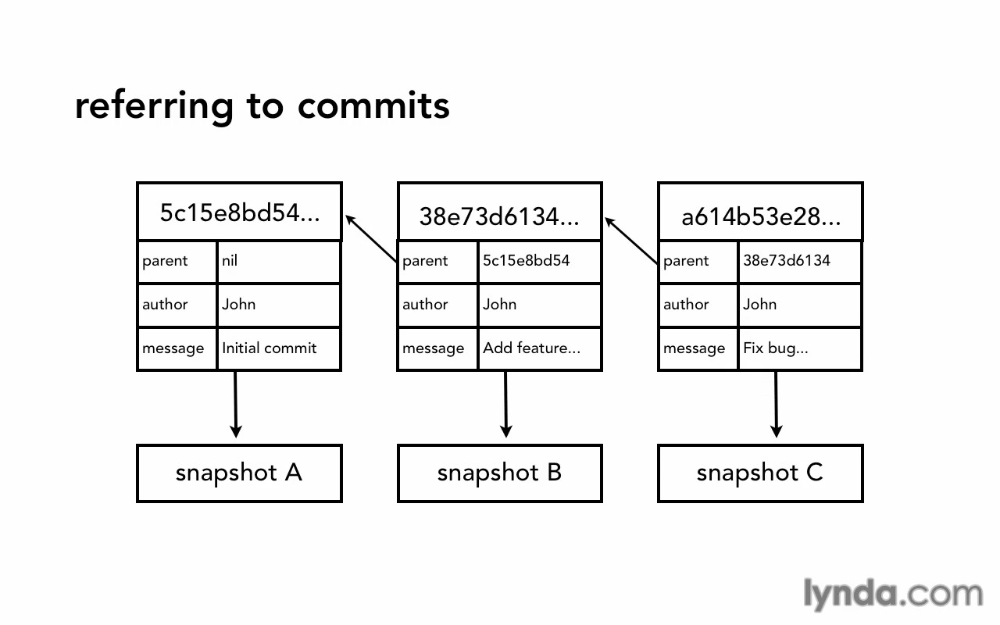

# Git Concepts and Architecture

* [How git save commits (Architecture)](#how-git-save-commits-architecture)
* [HEAD pointer](#head-pointer)

## How git save commits (Architecture)

## HEAD pointer
Pointer to "tip" of current branch in repo and top commit on it.

Git save HEAD pointer on .git/HEAD file, and from this file it'll navigate you to the commit it refer on it.
