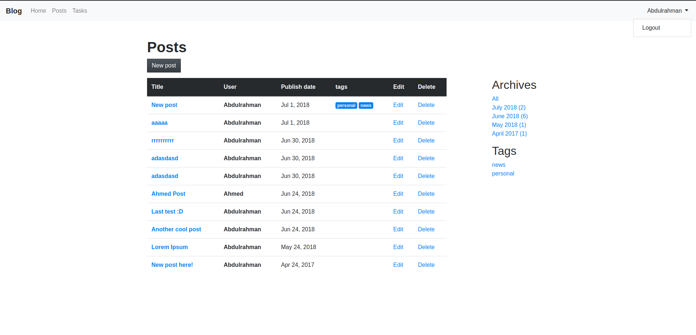

# Laravel 5.4
Let's begin using Laravel. :blue_heart:

## Index
* **1- Basic Routing and Views.**  
* **2- Pass Data to Your Views.**  
* **3- Working With the Query Builder.**  
* **[4- Eloquent 101.](./docs/4-eloquent.md)**  
* **5- Controllers.**  
* **6- Route Model Binding.**  
* **7- Layouts and Structure.**  
* **[8- Form Request Data and CSRF.](./docs/8-form-request.md)**  
* **9- Form Validation 101.**  
* **10- Rendering Posts.**  
* **11- Eloquent Relationships and Comments.**  
* **12- Add Comments.**  
* **13- Rapid Authentication and Configuration.**  
* **14- Associating With Users.**  
* **15- Archives.**  
* **16- View Composers.**  
* **17- Testing 101.**  
* **18- DI, Auto-Resolution, and Repositories.**  
* **19- The Service providers Container.**  
* **20- Form Requests and Form Objects.**  
* **21- Session Handling and Flash Messaging.**  
* **22- Tags and Pivot Tables**  
* **23- Sorting Posts By Tags**  

## Course Implementation

