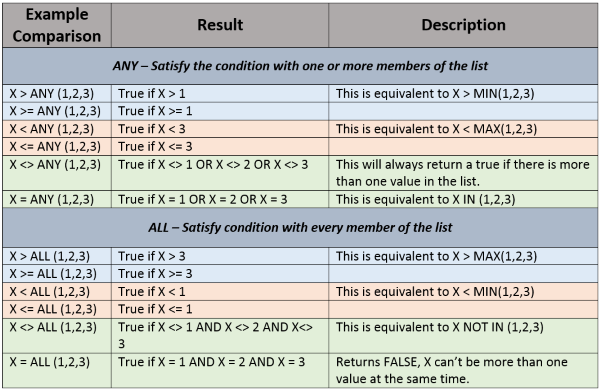

# SubQuery

* [Correlated SubQuery](#correlated-subquery) <br>
* [SubQuery With SELECT](#subquery-with-select) <br>
* [SubQuery With FROM](#subquery-with-from) <br>
* [SubQuery With WHERE / HAVING](#subquery-in-where--having) <br>
    * [SubQuery With IN](#subquery-with-in) <br>
    * [SubQuery With EXISTS](#subquery-with-exists) <br>
    * [EXISTS Clause vs IN Clause](#exists-clause-vs-in-clause) <br>
    * [SubQuery With ANY](#subquery-with-any) <br>
    * [SubQuery With ALL](#subquery-with-all) <br>
* [SubQuery vs JOIN](#subquery-vs-join) <br>

A MySQL `subquery` is a query nested within another query such as `SELECT`, `INSERT`, `UPDATE` or `DELETE`. In addition, a MySQL `subquery` can be nested inside another `subquery`.

A MySQL `subquery` is called an `inner query` while the query that contains the `subquery` is called an `outer query`. A `subquery` can be used anywhere that expression is used and must be closed in parentheses.

### Correlated SubQuery
You can use the `subquery` as standalone query, or you can uses the data from the `outer query` inside the `inner query`, in this case it called `correlated subquery`.

Notes `p1.productline` table.
```sql
SELECT
    productname,
    buyprice
FROM
    products p1
WHERE
    buyprice > (SELECT
                    AVG(buyprice)
                FROM
                    products
                WHERE
                    productline = p1.productline)
```

### SubQuery With SELECT
The `subquery` with `SELECT` must returns only one value.
```sql
SELECT
    SalesOrderID,
    LineTotal,
    (SELECT AVG(LineTotal)
     FROM SalesOrderDetail) AS AverageLineTotal
FROM SalesOrderDetail;
```

### SubQuery With FROM
```sql
SELECT
    MAX(items), MIN(items), FLOOR(AVG(items))
FROM
    (SELECT
        orderNumber, COUNT(orderNumber) AS items
    FROM
        orderdetails
    GROUP BY orderNumber) AS lineitems;
```

### SubQuery In WHERE / HAVING
```sql
SELECT
    customerNumber, checkNumber, amount
FROM
    payments
WHERE
    amount = (SELECT
                  MAX(amount)
               FROM
                  payments);
```

With `HAVING`

```sql
SELECT
    JobTitle,
    AVG(VacationHours) AS AverageVacationHours
FROM
    Employee
GROUP BY
    JobTitle
HAVING
    AVG(VacationHours) > (SELECT
                             AVG(VacationHours)
                          FROM
                             Employee);
```

### SubQuery With IN
When a `subquery` is used with the `IN` or `NOT IN` operator, a `subquery` returns a `Boolean` value of TRUE or FALSE.

```sql
SELECT
    lastName, firstName
FROM
    employees
WHERE
    officeCode IN (SELECT
                      officeCode
                   FROM
                      offices
                    WHERE
                      country = 'USA');
```

Also you can use it with `NOT IN`.

### SubQuery With EXISTS
When a `subquery` is used with the `EXISTS` or `NOT EXISTS` operator, a `subquery` returns a `Boolean` value of TRUE or FALSE.

```sql
SELECT
    *
FROM
    table_name
WHERE
    EXISTS( subquery );
```

Also you can use it with `NOT EXISTS`.

### EXISTS Clause vs IN Clause
* Use `EXISTS` when the subquery results is very large, and `IN` when the subquery results is very small or with static list, because `EXISTS` is faster then `IN` when deal with SubQuery.
* When `EXISTS` checks value contains `NULL` it returns `TRUE`, While `IN` returns `FALSE`, So use `EXISTS` when you want count `NULL` values, Or add `NOT NULL` in the SubQuery.

### SubQuery With ANY
`ANY` behave like `MIN` but with SubQuery.

```sql
SELECT
    ProductID,
    Name,
    SafetyStockLevel,
    DaysToManufacture
FROM
    Production.Product
WHERE  SafetyStockLevel > ANY (SELECT   AVG(SafetyStockLevel)
                               FROM     Production.Product
                               GROUP BY DaysToManufacture)
```

### SubQuery With ALL
`ALL` behave like `MAX` but with SubQuery.
```sql
SELECT
    ProductID,
    Name,
    SafetyStockLevel,
    DaysToManufacture
FROM
    Production.Product
WHERE  SafetyStockLevel > ALL (SELECT   AVG(SafetyStockLevel)
                               FROM     Production.Product
                               GROUP BY DaysToManufacture)
```

**Summary of Various Comparison Modifiers**



### SubQuery vs JOIN
Use JOIN when:
* You want to combining (show) data from two tables side by side.

Use SubQuery when:
* You want to combining just a **filtered** column from other table or the same table.
```sql
SELECT
    SalesOrderID,
    LineTotal,
    (SELECT AVG(LineTotal)
     FROM SalesOrderDetail) AS AverageLineTotal
FROM SalesOrderDetail;
```
* You want to filter current table data dependent on another table, in this case you will use SubQuery with `WHERE`, `IN`, `EXISTS`, `ANY` or `ALL`.
* You want to select `FROM` virtual table.

Please notes that `JOIN` **faster** then `SubQuery`, but `SubQuery` **more readable** from `JOIN`, **AND AFTER A LOT OF SEARCHING**  I think you need to use `SubQuery` in **simple / straight forward** queries, and `JOIN` with **complex** one.
