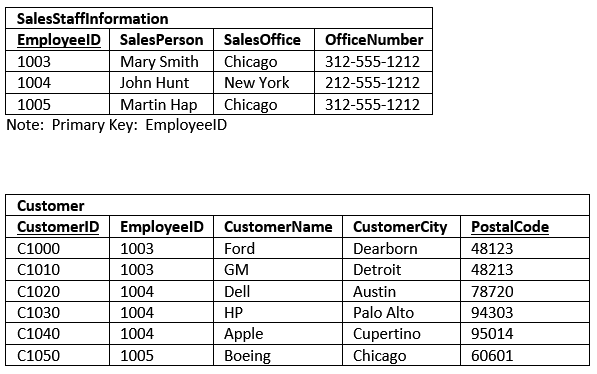

# First Normal Form

* [First Normal Form Definition](#first-normal-form-definition)
* [Apply In Our Example](#apply-in-our-example)

### First Normal Form Definition
The table be in the 2N if:
* Each column contains `atomic` values.
* There are not `repeating groups` of columns.
* The table stores information in rows and columns where one or more columns, called the `primary key`, uniquely identify each row.

Once a table is in first normal form it is easier to `search`, `filter`, and `sort` the information.

> Main purpose from 1N is eliminate data redundancy.

### Apply In Our Example

**This design is superior to our original table in several ways:**

* The original design limited each SalesStaffInformation entry to three customers.  In the new design, the number of customers associated to each design is practically unlimited.
* It was nearly impossible to Sort the original data by Customer.  You could, if you used the UNION statement, but it would be cumbersome.  Now, it is simple to sort customers.
* The same holds true for filtering on the customer table.  It is much easier to filter on one customer name related column than three.
* The insert and deletion anomalies for Customer have been eliminated.  You can delete all the customer for a SalesPerson without having to delete the entire SalesStaffInformaiton row.
