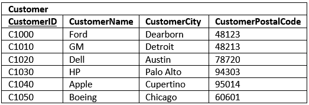
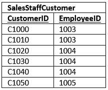

# Second Normal Form

* [Second Normal Form Definition](#second-normal-form-definition)
* [Apply In Our Example](#apply-in-our-example)

### Second Normal Form Definition
The table be in the 2N if:
* The table is in `1st normal form`.
* All the non-key columns are dependent on the table’s primary key `partial dependency`.

### Apply In Our Example

Now let's fix that!

> An **intersection table** is useful when you need to model a many-to-many relationship.

Three out of the four tables are even in third normal form, but there is one table which still has a minor issue.
