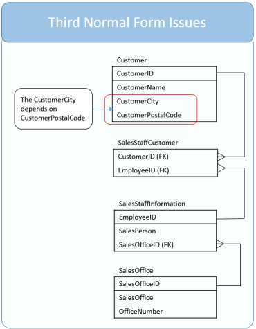
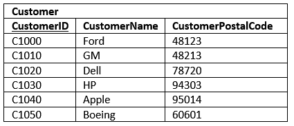
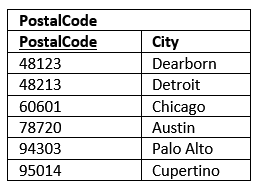

# Third Normal Form

* [Third Normal Form Definition](#third-normal-form-definition)
* [Apply In Our Example](#apply-in-our-example)

### Third Normal Form Definition
Once a table is in second normal form, we are guaranteed that `every column is dependent on the primary key`, or as I like to say, the table serves a `single purpose`.

The table be in the 3N if:
* A table is in 2nd normal form.
* It contains only columns that are `non-transitively dependent` on the primary key.

`transitive dependency` means a column’s value *relies* upon another column through a second intermediate column.

<pre>
    |--------------------------------------------------|
                                                       v
    |-------------------------------------|
                                          v
                                          |------------|
    |- key -|                                          v
    CourseID    CourseName    Semester    TeacherID    TeacherName
</pre>

Here the `TeacherName` is dependent on `CourseID` **through / and** `TeacherID`, and the `TeacherID` not a primary key ... this is a `transitive dependency`.

> Main purpose from 3N is avoid transfer the table to partial dependency and avoid update anomalies like update `TeacherID` without update `TeacherName`.

### Apply In Our Example

