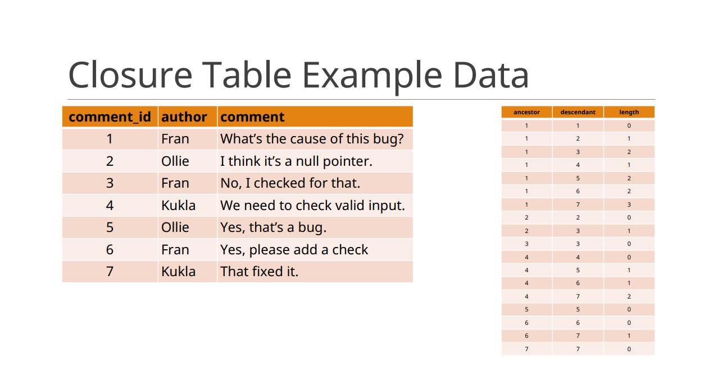

# Closure Table

* [Table Structure](#table-structure)
* [Closure Table Examples](#closure-table-examples)

Closure table is a simple and elegant way of storing and querying hierarchical data in any RDBMS. The Closure Table is a design for representing trees in a relational database by storing all the paths between tree nodes.


**Pros:**
* Single non-recursive query to get a tree or a subtree
* Referential integrity!

**Cons:**
* Extra table is required
* Hierarchy is stored redundantly, too easy to mess up
* Lots of joins to do most kinds of queries

### Table Structure
```sql
CREATE TABLE Closure (
    ancestor INT NOT NULL,
    descendant INT NOT NULL,
    length INT NOT NULL,
    PRIMARY KEY (ancestor, descendant),
    FOREIGN KEY(ancestor) REFERENCES Comments(comment_id),
    FOREIGN KEY(descendant) REFERENCES Comments(comment_id)
);
```



### Closure Table Examples
Query ancestors of comment #7:
```sql
SELECT
    c.*
FROM
    comments c
JOIN
    closure t
ON
    c.comment_id = t.ancestor
WHERE
    t.descendant = 7;
```

Query subtree under comment #4:
```sql
SELECT
    c.*
FROM
    comments c
JOIN
    closure t
ON
    c.comment_id = t.descendant
WHERE
    t.ancestor = 4;
```
