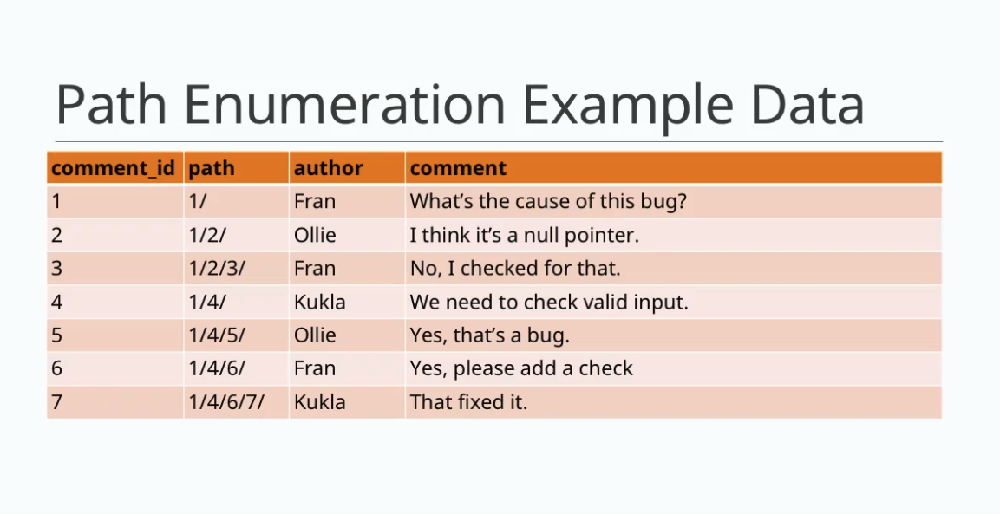

# Path Enumeration

* [Table Structure](#table-structure)
* [Path Enumeration Examples](#path-enumeration-examples)

Path enumeration looks like a web page breadcrumb. We start from a root point (most of the time "Home page") and we pass step by step to the current page. A little bit like that : Home page > News > IT > Programming.

To write this relation as a path enumeration, we concatenate all ids in ascending order (from root to current page) and separate them by a character other than a number (for example: `/`). It should give the following result : `/1/5/10/40/`. This results is our path enumeration ("databases breadcrumb").

**Pros**
* Single non-recursive query to get a tree or subtree.

**Cons**
* Complex updates to add or remove a node.
* Numbers are stored in a string no referential integrity.

### Table Structure


### Path Enumeration Examples
Get ancestors for comment #7:
```sql
SELECT * FROM comments
WHERE '1/4/6/7/' LIKE CONCAT(path, '%');
```

Get descendants of comment #4:
```sql
SELECT * FROM comments
WHERE path LIKE '1/4/%';
```
