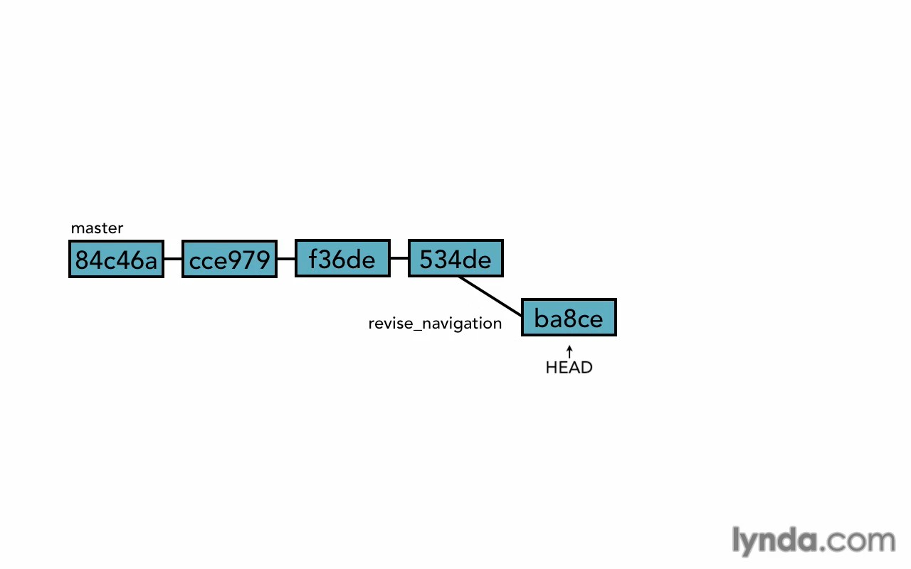

# Branching

* [Branch overview](#branch-overview)
* [Create branch](#create-branch)
* [Switch branches](#switch-branches)
* [Uncommitted changes](#uncommitted-changes)
* [Compare branches](#compare-branches)
* [Rename branch](#rename-branch)
* [Delete branch](#delete-branch)

## Branch overview
Branch is a great feature that allow you to try new ideas without any fear. It isolate those attempts from your master work and if they not working as you expected for any reasons you can get rid of them without headache for revert or delete. And if they work as expectation you can merge them with your master work.


HEAD will always point for last commit in current branch you checked-out.




## Create branch
To show branches on local machine.
```bash
git branch
```
To create new branch called (new_branch)
```bash
git branch new_branch
```

## Switch branches
To switch between branches.
```bash
git checkout new_branch
```
You can create and switch to new branch in same step.
```bash
git checkout -b new_branch
```

## Uncommitted changes
To switch between branches, your working dir must be clean or "mostly clean".

Git maybe gives you an error if you try to checkout and your working dir is not clean.<br>
Because git will lose all those changes if it doesn't gives you this error, in this case you have three options:<br>
1- Checkout your changes and lose them, so git can switch safely.<br>
2- Commit those changes, so you keep them on git.<br>
3- Stash them, to return for them later.

## Compare branches
To show the difference between two branches
```bash
git diff master..new_branch
# to show the difference between master and new_branch
```
You can use all options with normal diff here.

We can also use Tree-ish
```bash
git diff --color-words master..new_branch^
# to show the difference between master and previous HEAD commit on new_branch
```
To show all branches completely merged with our current branch
```bash
git branch --merged
# any branch will appear that's mean current branch contain all its commits.
```

## Rename branch
To rename branches we use move option.
```bash
git branch -m old_branch_name new_branch_name
# we can use --move or for shorten -m.
```

## Delete branch
To delete branch we use delete option.
```bash
git branch -d deleted_branch
# we can use --delete or for shorten -d.
```
* You can't delete the branch you working on, you must checkout any other branch and after that delete that branch.
* If you add some commits to branch and you wanna delete it, git will warring you to merge it first or use <code>git branch -D deleted_branch</code> to make sure you mean it.
