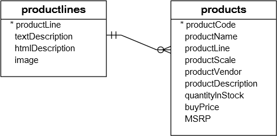
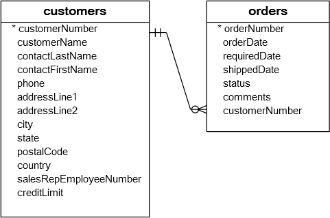
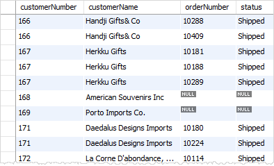
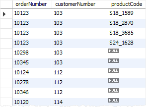

# JOIN

* [INNER JOIN](#inner-join) <br>
* [LEFT JOIN](#left-join) <br>
* [**Condition in WHERE vs ON**](#condition-in-where-vs-on) <br>
* [RIGHT JOIN](#right-join) <br>
* [CROSS JOIN](#cross-join) <br>
* [Self Join](#self-join) <br>

### INNER JOIN
The MySQL `INNER JOIN` clause matches rows in one table with rows in other tables and allows you to query rows that contain columns from both tables.


```sql
SELECT column_list
FROM t1
INNER JOIN t2 ON join_condition1
INNER JOIN t3 ON join_condition2
...
WHERE where_conditions;
```

**Example**



```sql
SELECT
    productCode,
    productName,
    textDescription
FROM
    products t1
        INNER JOIN
    productlines t2 ON t1.productline = t2.productline;
    # or
    productlines USING (productline);
```


### LEFT JOIN
The `LEFT JOIN` keyword returns all records from the left table (table1), and the matched records from the right table (table2). The result is `NULL` from the right side, if there is no match.


**Example**



```sql
SELECT
    c.customerNumber,
    customerName,
    orderNumber,
    status
FROM
    customers c
LEFT JOIN orders USING (customerNumber);
```



### Condition in WHERE vs ON
When use the condition in `ON` clause, that's means you want the join happened only when the conditions is true. Otherwise returns `NULL`.

```sql
SELECT
    o.orderNumber,
    customerNumber,
    productCode
FROM
    orders o
        LEFT JOIN
    orderDetails d ON o.orderNumber = d.orderNumber
                   AND o.orderNumber = 10123;
```



But when use the condition with `WHERE`, That's means you want to **(filter) limit the result**.

```sql
SELECT
    o.orderNumber,
    customerNumber,
    productCode
FROM
    orders o
        LEFT JOIN
    orderDetails USING (orderNumber)
WHERE
    orderNumber = 10123;
```


> Notice that for `INNER JOIN` clause, the condition in the `ON` clause is equivalent to the condition in the `WHERE` clause.

### RIGHT JOIN
The `RIGHT JOIN` keyword returns all records from the right table (table2), and the matched records from the left table (table1). The result is NULL from the left side, when there is no match.

```sql
SELECT
    concat(e.firstName,' ', e.lastName) salesman,
    e.jobTitle,
    customerName
FROM
    employees e
RIGHT JOIN
    customers c ON e.employeeNumber = c.salesRepEmployeeNumber
                AND e.jobTitle = 'Sales Rep'
ORDER BY customerName;
```


### CROSS JOIN
The `CROSS JOIN` clause returns the `Cartesian product` of rows from the joined tables.

```sql
SELECT *
FROM
    T1
CROSS JOIN
    T2
```

Note that different from the `INNER JOIN` or `LEFT JOIN` clause, the `CROSS JOIN` clause **does not have the join conditions**.

If you add a `WHERE` clause, in case T1 and T2 has a relationship, the `CROSS JOIN` works like the `INNER JOIN` clause as shown in the following query:

```sql
SELECT *
FROM
    T1
CROSS JOIN
    T2
WHERE
    T1.id = T2.id;
```

### Self JOIN
If you need join a table to itself, is known as `self join`. And you must use a table alias to help MySQL distinguish the left table from the right table of the same table in a single query.

You can use all kind of JOINs to make a self join.
```sql
SELECT
    IFNULL(CONCAT(m.lastname, ', ', m.firstname), 'Top Manager') AS 'Manager',
    CONCAT(e.lastname, ', ', e.firstname) AS 'Direct report'
FROM
    employees e
INNER JOIN
    employees m ON m.employeeNumber = e.reportsto
ORDER BY manager;
```
