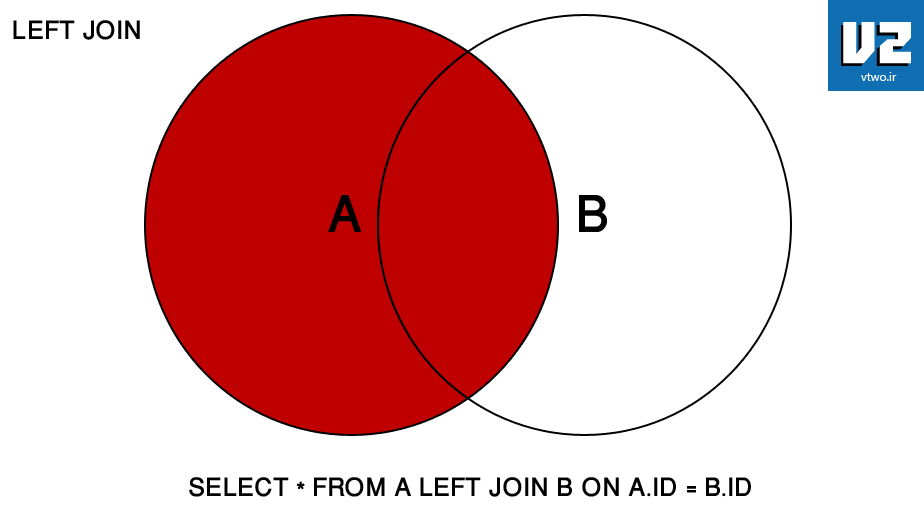
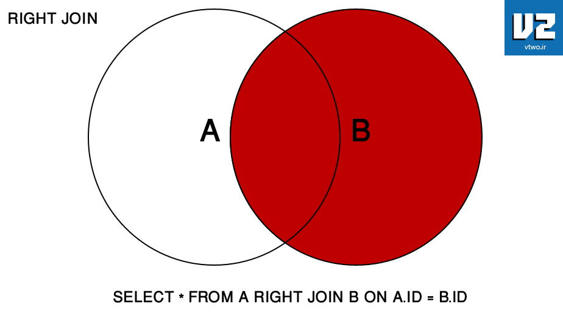
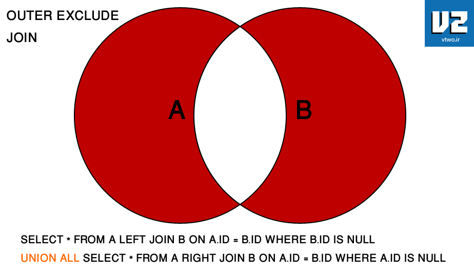

# UNION / JOIN Summary

### UNION vs JOIN

A `JOIN` combines result sets **horizontally**, a `UNION` appends result set **vertically**. The following picture illustrates the difference between `UNION` and `JOIN`:

### Simulate All Possibilities for JOIN / UNION With Queries

