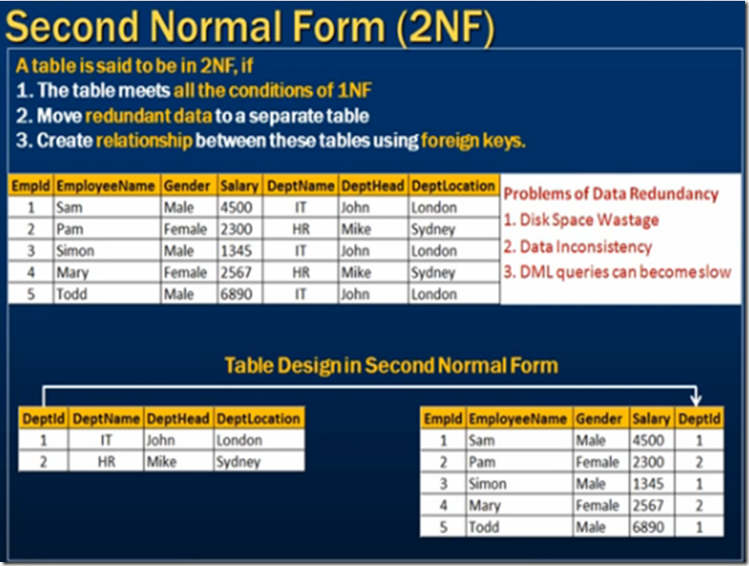
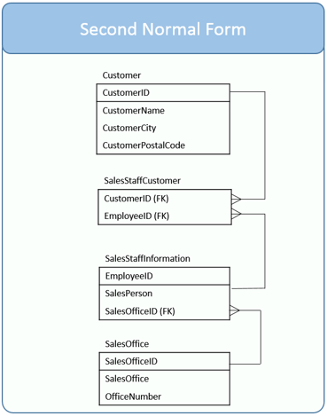
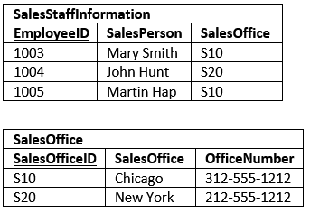

# Second Normal Form

* [Second Normal Form Definition](#second-normal-form-definition)
* [Apply In Our Example](#apply-in-our-example)

### Second Normal Form Definition
The table be in the 2N if:
* The table is in `1st normal form`.
* All the non-key columns are **fully** dependent on the table’s primary key / keys, if not this is called `partial dependency`.

<pre>
                                          not dependent on any primary keys
                                          ??
                                          |
    |- key -|                             v
    CourseID    CourseName    Semester    UniversityManager
</pre>
Or
<pre>
                                          |--- dependent on one key ---|
                                          |------------|---------------|
    |- key -|                             |- key -|    v               v
    CourseID    CourseName    Semester    SubjectID    SubjectName    SubjectGrade
</pre>

> Main purpose from 2N is make a single purpose table to avoid modification anomalies.

### Apply In Our Example

Now let's fix that!

> An **intersection table** is useful when you need to model a many-to-many relationship.

Three out of the four tables are even in third normal form, but there is one table which still has a minor issue.
