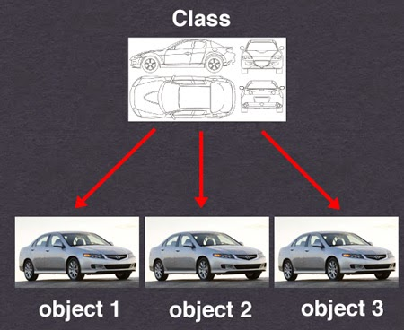

# Classes and Objects Cheat Sheet

* [Class vs. Object](#class-vs-object)
* [Abstract Class vs. Interface](#abstract-class-vs-interface)
* [Why static method considered a bad OO practice?](#why-static-method-considered-a-bad-oo-practice)

## Class vs. Object
The `class` is a blueprint for the objects. and the `object` is an instance of the class.

## Abstract Class vs. Interface
Abstract Class | Interface
---|---|
An abstract class can have both abstract and non-abstract methods. | The interface can have only *public* methods.
It does not support multiple inheritances. | It supports multiple implements.
It can provide the implementation of the interface. | It can not provide the implementation of the abstract class.

## Why static method considered a bad OO practice?
[Read here](http://verraes.net/2014/06/when-to-use-static-methods-in-php/)
